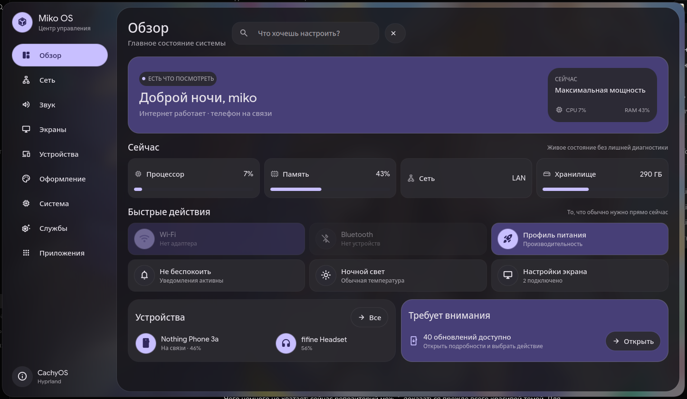
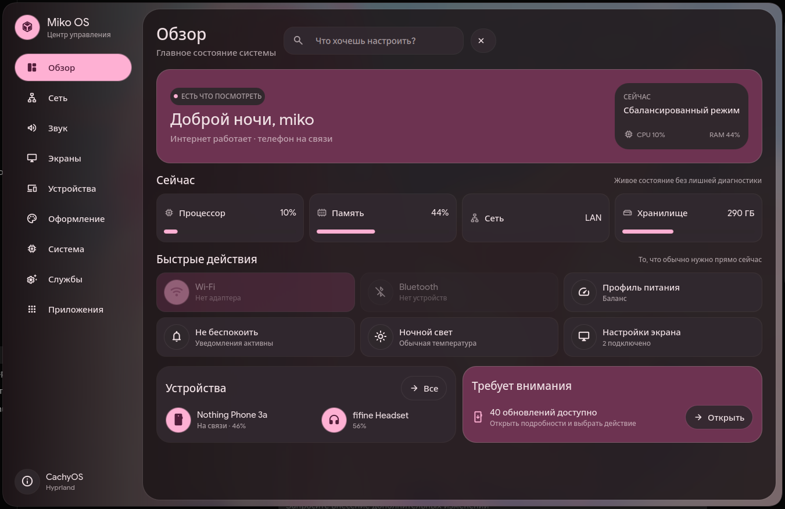
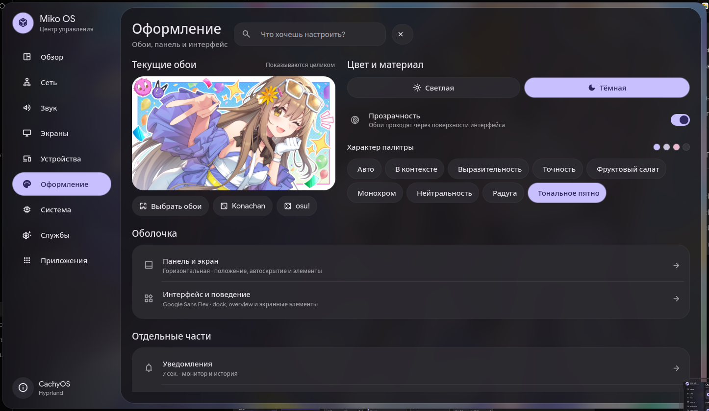
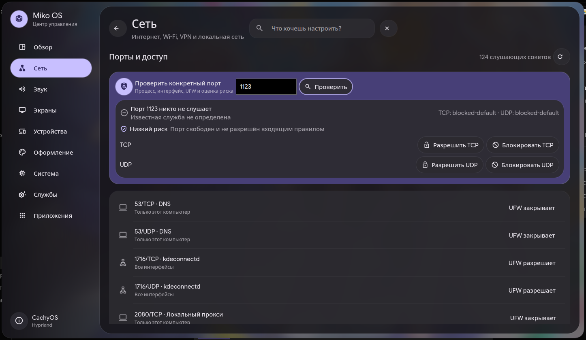
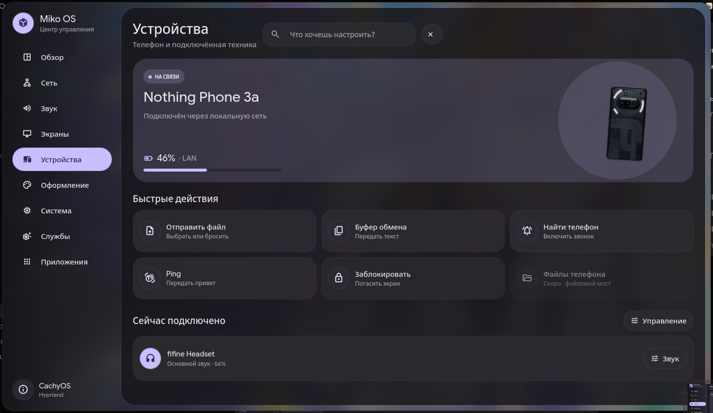
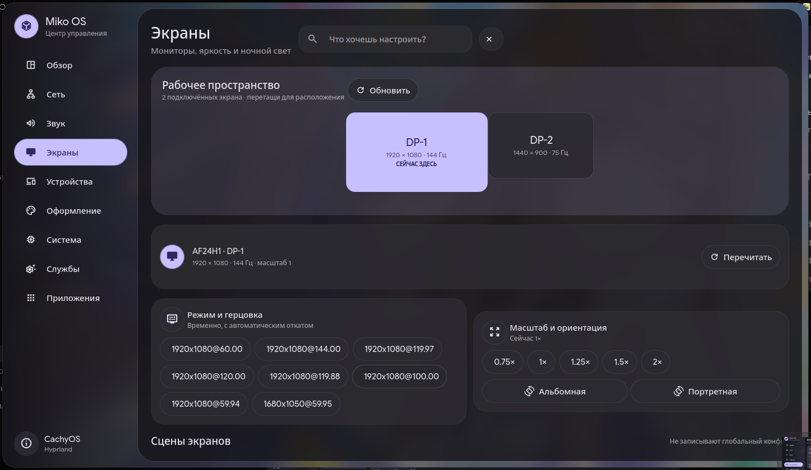
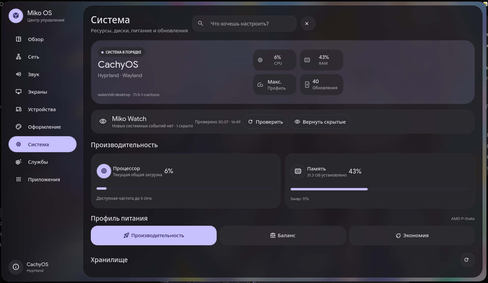
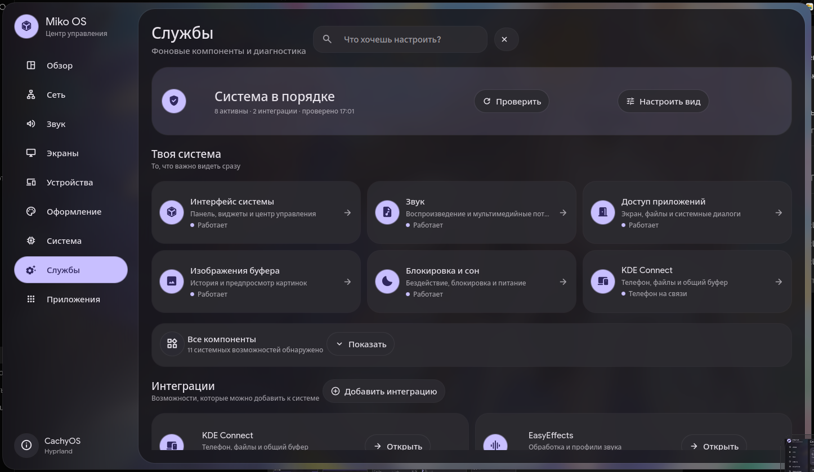

# Miko Control Center

**Русский** · [English version](README.md)

Десктопный центр управления для кастомной Linux-системы, написанный на
[Quickshell](https://quickshell.org/), Qt Quick и runtime оболочки
`illogical-impulse` (`ii`).

Miko Control Center собирает повседневные настройки, диагностику и персональные
интеграции в одном цельном интерфейсе, не делая вид, что все Linux-компьютеры
устроены одинаково.

> [!WARNING]
> **Экспериментальный проект.** Это персональный системный компонент,
> опубликованный для изучения, адаптации и повторного использования. На
> авторской системе Arch/Hyprland он работает полноценно, но API, внешний вид и
> установка ещё могут меняться. Это пока не универсальная замена настройкам
> любого дистрибутива.



## Интерфейс

Интерфейс использует Material-палитру из текущих обоев, а не один навсегда
заданный акцентный цвет.

| Другая палитра | Редактор оформления |
| --- | --- |
|  |  |

<details>
<summary><strong>Больше скриншотов</strong></summary>

| Сеть и порты | Телефон и устройства |
| --- | --- |
|  |  |

| Рабочее пространство экранов | Здоровье системы |
| --- | --- |
|  |  |

| Службы и интеграции |
| --- |
|  |

</details>

## Главное

- Обзор процессора, памяти, дисков, сети, устройств и проблем системы.
- Состояние сети, маршрут, диагностика соединения и отдельный инспектор портов.
- Опциональная интеграция Throne: туннель, профиль и живой трафик.
- Выходы, микрофоны и громкость приложений PipeWire.
- Топология экранов, режимы, масштаб, ночной свет и сцены мониторов.
- KDE Connect: телефон, буфер и передача файлов через drag-and-drop.
- Обзор USB- и Bluetooth-устройств.
- Цвета из обоев и управление внешностью оболочки.
- Обновления, очистка, профили питания и здоровье системы.
- Службы, интеграции, диагностика и Miko Watch.
- Процессы, автозапуск, уведомления и активность приватных устройств.
- Клавиатурная навигация, быстрая прокрутка и спокойные desktop-анимации.

Полная таблица возможностей находится в
[docs/ru/FEATURES.md](docs/ru/FEATURES.md).

## Совместимость

Текущий поддерживаемый профиль:

- Arch Linux или производный дистрибутив;
- Hyprland;
- Quickshell с runtime `illogical-impulse`;
- PipeWire/WirePlumber;
- пользовательские службы systemd.

Необязательные программы определяются автоматически, и часть интерфейса умеет
переходить в понятное отключённое состояние. При этом проект **не является
самостоятельным QML-пакетом**: он использует модели, виджеты и службы окружающей
оболочки `ii`.

Перед установкой прочитайте
[docs/ru/LIMITATIONS.md](docs/ru/LIMITATIONS.md).
Типовые проблемы запуска и интеграций разобраны в
[docs/ru/TROUBLESHOOTING.md](docs/ru/TROUBLESHOOTING.md).

## Установка

Клонируйте репозиторий и выполните безопасную проверку:

```bash
git clone https://github.com/Walenhill/miko-control-center.git
cd miko-control-center
./scripts/doctor.sh
```

Посмотрите, какие файлы будут установлены:

```bash
./scripts/install.sh --dry-run
```

Установите центр в пользовательские XDG-каталоги:

```bash
./scripts/install.sh
```

Установщик:

1. проверяет наличие совместимого runtime `ii`;
2. сохраняет предыдущий центр управления в XDG state;
3. устанавливает QML, лаунчер, desktop-файл и иконку;
4. не перезапускает основной процесс Quickshell.

Запуск через меню приложений или командой:

```bash
miko-control-center
```

Удаление только принадлежащих проекту файлов:

```bash
./scripts/uninstall.sh
```

Поддерживаются `XDG_CONFIG_HOME`, `XDG_DATA_HOME`, `XDG_STATE_HOME` и
`XDG_BIN_HOME`.

## Структура

```text
src/
  control-center.qml       точка сборки приложения
  controlcenter/           страницы, контроллеры, роутинг и UI-примитивы
packaging/
  bin/                     переносимый лаунчер
  applications/            desktop-файл
  icons/                   иконка приложения
scripts/
  install.sh               безопасная XDG-установка
  uninstall.sh             контролируемое удаление
  doctor.sh                read-only отчёт о возможностях
  check.sh                 проверка репозитория
docs/
  en/                      английская документация
  ru/                      русская документация
```

## Разработка

Интерфейс разделён на четыре слоя:

1. повторно используемые визуальные примитивы `Miko*`;
2. предметные контроллеры, владеющие процессами и системным состоянием;
3. страницы, собранные из небольших секций;
4. реестр, роутер, окружение и проверка доступных возможностей.

Отдельный экземпляр для разработки:

```bash
qs -p "${XDG_CONFIG_HOME:-$HOME/.config}/quickshell/ii/control-center.qml"
```

Ради проверки приложения не нужно перезапускать основную оболочку.

Правила архитектуры и расширения описаны в
[docs/ru/ARCHITECTURE.md](docs/ru/ARCHITECTURE.md).

## Безопасность

В центре есть действия для обновления пакетов, очистки, перезапуска
пользовательских служб, изменения экранов и проверки firewall. Потенциально
опасные или disruptive-действия должны оставаться явными и подтверждаемыми.

Во время визуального smoke-теста их нельзя вызывать автоматически.

## Лицензия

Miko Control Center распространяется по [лицензии MIT](LICENSE). Внешние проекты
и runtime-зависимости сохраняют собственные лицензии.
